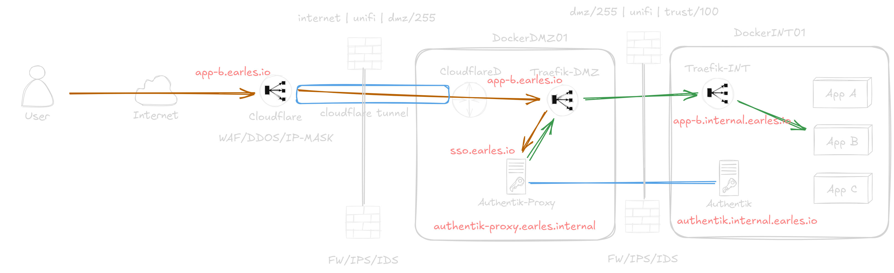

## Authentik External SSO Architecture

## Notes
- Do I reconfigure DMZ DNS Names to be app-b.dmz.earles.io and only point *.earles.io to cloudflare?
    - Possibly makes sense for HTTP/Cloudflare protected apps, but what about direct?
    - In diagram I have authentik-proxy.earles.internal but this is inaccruate since it sits behind traefik-dmz... add *.dmz.earles.io ?
- Is the DMZ/INT model excessive? Considering docker network isolation and cloudflare.