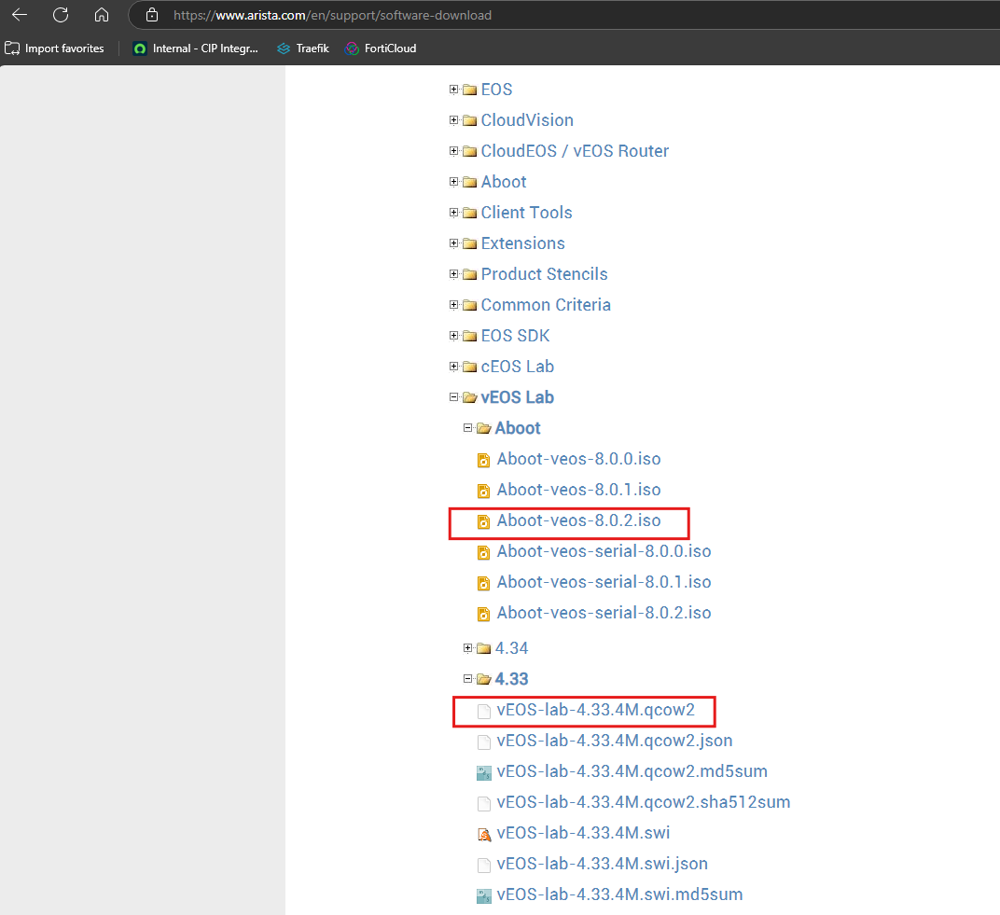

# Arista vEOS Lab VM
How to configure a vEOS Lab VM in Proxmox.

## Images
* Images are available here: https://www.arista.com/en/support/software-download with a free account and no associated support contract.
* Download both your firmware image file: [vEOS-lab-4.33.4M.qcow2](https://www.arista.com/surl/b7x4zL43HB) and the Aboot boot loader ISO: [Aboot-veos-8.0.2.iso](https://www.arista.com/surl/D9A8AdzHH)

## Proxmox VM Config
* Create VM with the following specs:
    * `2` vCPU
    * `4GB` Memory
    * CPU: `Host`
    * Display: `Serial`
    * Boot Media: `Aboot-veos-8.0.2.iso`
* Once VM is created, proceed to:
    * Detach and delete the generic hard disk
    * Add Serial0: `socket`
    * Run `sudo qm disk import ### vEOS-lab-4.34.1F.qcow2 local-lvm` for the appropriate vmid (620).
* See ./620.conf for example.

## Default Credentials
Once the VM is running, you can login with `admin` and no password. `enable`, `configure`, `username admin privilege 15 secret 0 <your-password>`